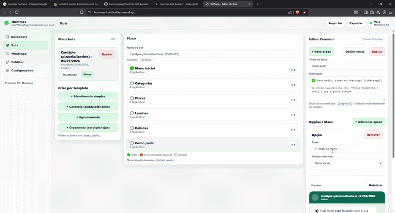

# BotSuite Bots MVP (templates + editor)
Early-stage SaaS MVP for a visual WhatsApp bot builder.
Focus: architecture validation, UX and conversational flow modeling.



Um MVP simples (React + Vite + TypeScript) para:
- escolher um template de bot
- criar um bot baseado no template
- editar nós (mensagem) e opções (menu) num fluxo tipo árvore
- preview do nó atual
- exportar/importar JSON

## Requisitos
- Node.js 18+ (recomendado 20+)
- npm

## Rodar
```bash
npm install
npm run dev
```

Abra o link que aparecer (geralmente http://localhost:5173).

## Build
```bash
npm run build
npm run preview
```

## Estrutura
- src/templates: templates prontos (Atendimento, Cardápio, Agendamento, Orçamento)
- src/types: modelo de dados do bot
- src/storage: salva no localStorage (MVP)
- src/components: UI do editor (árvore + editor + preview)

## Próximos passos (quando vocês quiserem)
- trocar localStorage por Supabase/Postgres
- adicionar publish e runtime (WhatsApp Cloud API)
- adicionar "fallback IA" quando usuário digitar fora do menu

## Deploy na Vercel (demo pública)
1) Suba este repositório no GitHub
2) Na Vercel: **New Project** → selecione o repo
3) Framework preset: **Vite** (auto)
4) Build Command: `npm run build`
5) Output Directory: `dist`
6) Deploy ✅

> Observação: esta demo é apenas o **builder/editor**. Não conecta no WhatsApp em produção.
